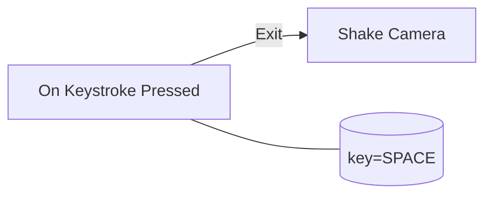

# On Keystroke Pressed
**ID**: `on_keystroke_pressed`  |  **Category**: Events  |  **Since**: 1.0.0

指定キーが押された瞬間にフローを開始するイベントノード。

キー押下でトリガーされるイベント。Enter（フロー入力）は持たず、Exit（フロー出力）のみ。 長押し・連打の扱いは `repeat_interval` で制御可能。


## Ports

### Flow Inputs
- (none)

### Flow Outputs
- **Exit** — イベント発火時に後続を実行

### Data Inputs
| name | type | required | default | notes |
|------|------|----------|---------|-------|
| `key` | `KeyCode` | yes | K |  |
| `repeat_interval` | `float` | no | 0.0 |  |

### Data Outputs
| name | type | required | default | notes |
|------|------|----------|---------|-------|
| `pressed_at` | `timestamp` | no |  | 押下時刻（エポック秒） |

## Behavior
- **Triggers**:
  - key_down (key == configured key)
- **Notes**:
  - 同時押しは未サポート（将来の拡張で変更の可能性あり）

## Examples
### スペース押下でカメラを揺らす

### 0.3秒間隔でリピート
```yaml
key: SPACE
repeat_interval: 0.3

```

## Links
- Related: `shake_camera`, `throttle_flow`
